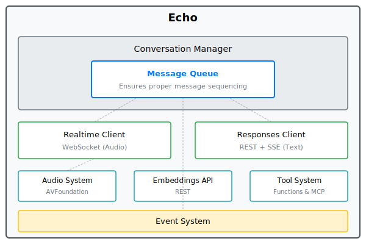
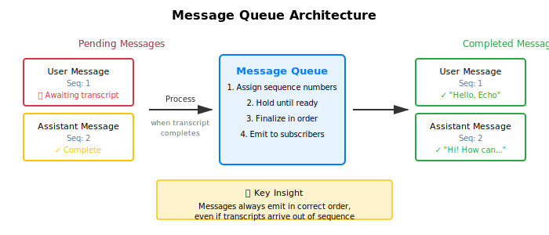
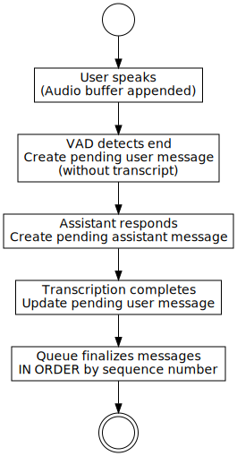
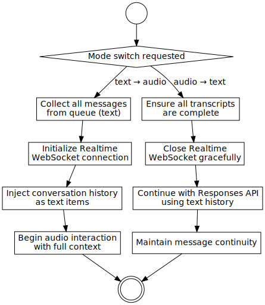
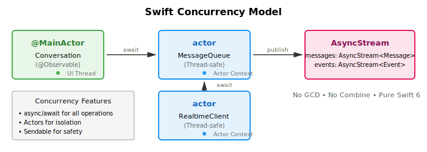
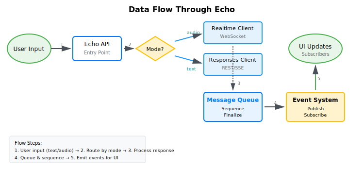

# Echo Architecture Specification

**Version 1.0.0** | **Swift 6.2+** | **iOS 18+ / macOS 14+**

---

## Table of Contents

1. [Executive Summary](#1-executive-summary)
2. [Requirements Specification](#2-requirements-specification)
3. [System Architecture](#3-system-architecture)
4. [Component Specifications](#4-component-specifications)
5. [API Specification](#5-api-specification)
6. [Implementation Guide](#6-implementation-guide)
7. [Integration Guide](#7-integration-guide)
8. [Testing Strategy](#8-testing-strategy)
9. [Appendices](#9-appendices)

---

## 1. Executive Summary

### 1.1 Project Overview

Echo is a unified Swift library that seamlessly integrates OpenAI's Realtime API (WebSocket-based voice) and Responses API (REST-based text) under a single, expressive interface. The library enables sophisticated conversational AI applications that switch effortlessly between audio and text modes while maintaining full conversation context.

### 1.2 Key Features

- **🎙️ Voice Conversations** - Real-time speech-to-speech using WebSocket connection
- **💬 Text Chat** - Traditional text conversations with SSE streaming support
- **🔄 Seamless Mode Switching** - Switch between voice and text mid-conversation
- **🧮 Embeddings API** - Generate and search text embeddings
- **📋 Structured Output** - Type-safe JSON generation with Codable schemas
- **🛠️ Tool Calling** - Function calling with automatic execution
- **📊 Event-Driven** - Comprehensive event system for reactive UIs
- **🎯 Expressive API** - Conversational namespace design (`echo.start.conversation()`)

### 1.3 Target Platforms

- **iOS 18.0+** / **macOS 14.0+**
- **Swift 6.2+** with strict concurrency
- **Xcode 16.0+**

### 1.4 Quick Navigation

- **For Library Users** → Start with [Section 7: Integration Guide](#7-integration-guide)
- **For Contributors** → Review [Section 6: Implementation Guide](#6-implementation-guide)
- **For Architects** → Focus on [Section 3: System Architecture](#3-system-architecture)
- **For API Reference** → See [Section 5: API Specification](#5-api-specification)

---

## 2. Requirements Specification

### 2.1 Functional Requirements

#### 2.1.1 Core Conversation Management
- **FR-1**: Support text-based conversations via Responses API
- **FR-2**: Support voice-based conversations via Realtime API
- **FR-3**: Enable seamless mode switching with context preservation
- **FR-4**: Maintain ordered message history regardless of mode
- **FR-5**: Support system instructions/prompts

#### 2.1.2 Audio Requirements
- **FR-6**: Capture audio from device microphone
- **FR-7**: Play audio responses through device speakers
- **FR-8**: Support Voice Activity Detection (VAD)
- **FR-9**: Provide audio level monitoring for UI animations
- **FR-10**: Support multiple turn detection modes (automatic/manual/disabled)

#### 2.1.3 API Features
- **FR-11**: Generate text embeddings for semantic search
- **FR-12**: Create structured JSON outputs with type safety
- **FR-13**: Support function/tool calling
- **FR-14**: Stream responses for real-time UI updates
- **FR-15**: Handle interruptions and cancellations

### 2.2 Non-Functional Requirements

#### 2.2.1 Performance
- **NFR-1**: WebSocket latency < 500ms for audio mode
- **NFR-2**: Support conversations up to 128k tokens
- **NFR-3**: Handle audio streams up to 5 minutes duration
- **NFR-4**: Process embeddings batches up to 100 texts

#### 2.2.2 Reliability
- **NFR-5**: Automatic reconnection for WebSocket disconnections
- **NFR-6**: Exponential backoff retry for REST API failures
- **NFR-7**: Rate limiting compliance with token bucket algorithm
- **NFR-8**: Graceful degradation when switching modes fails

#### 2.2.3 Usability
- **NFR-9**: Expressive, discoverable API design
- **NFR-10**: Comprehensive event system for UI integration
- **NFR-11**: Type-safe interfaces with Swift 6 concurrency
- **NFR-12**: Zero external dependencies for core functionality

### 2.3 Model Requirements (STRICT)

**⚠️ CRITICAL: Echo supports ONLY these specific OpenAI models. Any other model will throw a runtime error.**

#### 2.3.1 Realtime API Models (Audio Mode)
- **`gpt-realtime`** - Standard real-time audio model (4096 max tokens)
- **`gpt-realtime-mini`** - Optimized for lower latency (2048 max tokens)

#### 2.3.2 Responses API Models (Text Mode)
- **`gpt-5`** - Most capable text model (8192 max tokens)
- **`gpt-5-mini`** - Balanced performance (4096 max tokens)
- **`gpt-5-nano`** - Fastest, lightweight (2048 max tokens)

#### 2.3.3 Embeddings API Models
- **`text-embedding-3-small`** - Cost-effective (1536 dimensions)
- **`text-embedding-3-large`** - High quality (3072 dimensions)
- **`text-embedding-ada-002`** - Legacy support (1536 dimensions)

#### 2.3.4 Transcription Models
- **`whisper-1`** - Speech-to-text for Realtime API

**NO OTHER MODELS ARE SUPPORTED.** Models like gpt-4, gpt-3.5-turbo, claude, etc. will be rejected.

### 2.4 Platform Requirements

- **Swift**: Version 6.0 or higher with StrictConcurrency
- **iOS**: Version 18.0 or higher
- **macOS**: Version 14.0 or higher
- **Dependencies**:
  - `AsyncHTTPClient` 1.20.0+ (for REST/SSE)
  - `AsyncAlgorithms` 1.0.0+ (for stream operations)
  - AVFoundation (built-in, for audio)

### 2.5 Constraints and Assumptions

#### 2.5.1 Constraints
- Must use URLSessionWebSocketTask for WebSocket (no third-party)
- Must use AVFoundation for audio (no third-party)
- Must validate models at runtime (fail fast on unsupported models)
- Cannot use deprecated Swift patterns (Combine, GCD, etc.)

#### 2.5.2 Assumptions
- Users have valid OpenAI API keys
- Network connectivity is available
- Audio permissions are granted by user
- Device has microphone and speakers

---

## 3. System Architecture

### 3.1 Architectural Principles

Echo unifies two fundamentally different APIs under a single interface through:

1. **Mode-Agnostic Conversation State** - Every interaction (voice or text) is stored as text, enabling seamless transitions
2. **Central Message Queue** - Ensures proper sequencing, critical for audio where responses may arrive before transcription
3. **Event-Driven Design** - Expressive syntax like `echo.when(.userStartedSpeaking)` for reactive patterns
4. **Storage Agnostic** - No built-in persistence; integrates with any storage layer

### 3.2 High-Level Architecture



The architecture diagram above shows Echo's modular design with:
- **Central Message Queue** at the core for message sequencing
- **Dual API clients** (Realtime WebSocket and Responses REST/SSE)
- **Supporting systems** (Audio, Embeddings, Events)
- **Unified interface** through the Echo main API

### 3.3 Central Message Queue Architecture

The message queue is Echo's most critical component, solving the out-of-order message problem in audio mode:



**Audio Mode Message Flow:**



1. User speaks → Audio buffer appended
2. VAD detects end → Creates pending message (no transcript yet)
3. Assistant responds → Creates pending message
4. User transcript completes → Updates pending message
5. Queue finalizes messages IN ORDER by sequence number

#### 3.3.1 Queue States

```swift
enum TranscriptStatus {
    case notStarted      // Audio received, no transcript
    case inProgress      // Transcription processing
    case completed       // Transcript available
    case notApplicable   // Text-only message
}
```

#### 3.3.2 Sequencing Algorithm

1. Assign monotonically increasing sequence numbers
2. Hold messages until transcript completes or not needed
3. Release messages in sequence order
4. Emit events for UI updates

### 3.4 Mode Switching Mechanism



#### 3.4.1 Text → Audio Transition
1. Get all messages from queue (text format)
2. Initialize Realtime WebSocket connection
3. Inject conversation history as text items
4. Begin audio interaction with full context

#### 3.4.2 Audio → Text Transition
1. Ensure all transcripts are complete
2. Close Realtime WebSocket gracefully
3. Continue with Responses API using text history
4. Maintain message continuity

### 3.5 Concurrency Model



Echo uses Swift's modern concurrency features:

- **Actors** for thread-safe state management (`MessageQueue`, `RealtimeClient`)
- **async/await** for all asynchronous operations
- **AsyncStream** for message and event delivery
- **@Observable** for SwiftUI integration
- **Sendable** conformance for concurrent access

### 3.6 Data Flow



The data flow shows how user input travels through the system:
1. **Input Processing**: User input enters through Echo API
2. **Mode Routing**: Routes to appropriate client based on current mode
3. **Response Processing**: Client processes and returns responses
4. **Message Queue**: Ensures proper sequencing of all messages
5. **Event System**: Publishes events for UI updates
6. **UI Updates**: Final presentation to the user

---

## 4. Component Specifications

### 4.1 Core Components

#### 4.1.1 Echo
**Responsibility**: Main entry point and configuration
- Manages global configuration
- Creates conversations
- Registers tools and event handlers
- Provides namespace accessors (`.start`, `.generate`, `.find`)

#### 4.1.2 Conversation
**Responsibility**: Manages a single conversation session
- Coordinates mode switching
- Maintains message history
- Handles turn management
- Routes to appropriate client (Realtime/Responses)

#### 4.1.3 MessageQueue
**Responsibility**: Ensures proper message ordering
- Manages pending and completed messages
- Handles out-of-order transcript updates
- Maintains sequence numbers
- Publishes finalized messages

#### 4.1.4 TurnManager
**Responsibility**: Controls conversation flow in audio mode
- Implements VAD-based turn detection
- Supports manual turn control
- Handles interruptions
- Manages timeouts

### 4.2 Realtime API Components

#### 4.2.1 RealtimeClient
**Responsibility**: WebSocket communication with Realtime API
- Manages WebSocket lifecycle
- Handles audio streaming
- Processes server events
- Validates models (`gpt-realtime`, `gpt-realtime-mini` only)

#### 4.2.2 WebSocketManager
**Responsibility**: Low-level WebSocket operations
- Uses URLSessionWebSocketTask
- Handles reconnection logic
- Manages message framing
- Provides event stream

#### 4.2.3 AudioCapture
**Responsibility**: Microphone input handling
- Uses AVAudioEngine
- Converts to PCM16 format
- Base64 encodes for transmission
- Monitors audio levels

#### 4.2.4 AudioPlayback
**Responsibility**: Speaker output handling
- Queues audio chunks
- Manages playback state
- Handles interruptions
- Provides completion events

### 4.3 Responses API Components

#### 4.3.1 ResponsesClient
**Responsibility**: REST/SSE communication with Responses API
- Makes HTTP requests
- Parses SSE streams
- Validates models (`gpt-5`, `gpt-5-mini`, `gpt-5-nano` only)
- Handles structured outputs

#### 4.3.2 HTTPClient
**Responsibility**: HTTP transport layer
- Uses AsyncHTTPClient
- Implements retry logic
- Handles rate limiting
- Manages timeouts

#### 4.3.3 SSEParser
**Responsibility**: Server-sent events parsing
- Parses event streams
- Handles chunked responses
- Manages buffer state
- Emits typed events

### 4.4 Supporting Systems

#### 4.4.1 EventEmitter
**Responsibility**: Event publication and subscription
- Type-safe event handling
- Async handler support
- Multiple subscriber management
- Event filtering

#### 4.4.2 Tool System
**Responsibility**: Function calling support
- Tool registration
- Automatic execution
- Result submission
- MCP server integration

#### 4.4.3 EmbeddingsClient
**Responsibility**: Text embedding generation
- Batch processing
- Dimension configuration
- Similarity calculations
- Model validation

---

## 5. API Specification

### 5.1 Echo Initialization

```swift
public class Echo {
    /// Initialize with API key and configuration
    public init(
        key: String,
        configuration: EchoConfiguration = .default,
        automaticToolExecution: Bool = true
    )
}
```

### 5.2 Conversation Management

```swift
extension Echo {
    /// Start a new conversation
    public func startConversation(
        mode: EchoMode,
        systemMessage: String? = nil
    ) async throws -> Conversation
    
    /// Start with specific turn mode
    public func startConversation(
        mode: EchoMode,
        turnMode: TurnDetection,
        systemMessage: String? = nil
    ) async throws -> Conversation
}
```

### 5.3 Conversation API

```swift
public class Conversation {
    /// Current mode (audio or text)
    public var mode: EchoMode { get async }
    
    /// Send a message
    public func send(_ text: String) async throws
    
    /// Switch modes
    public func switchMode(to: EchoMode) async throws
    
    /// Message stream
    public var messages: AsyncStream<Message> { get }
    
    /// All messages
    public var allMessages: [Message] { get async }
    
    /// End user turn (manual mode)
    public func endUserTurn() async throws
    
    /// Interrupt assistant
    public func interruptAssistant() async throws
    
    /// Mute/unmute microphone
    public func setMuted(_ muted: Bool) async throws
}
```

### 5.4 Event System

```swift
extension Echo {
    /// Register event handler
    public func when(
        _ eventType: EventType,
        handler: @escaping (EchoEvent) -> Void
    )
    
    /// Register async handler
    public func when(
        _ eventType: EventType,
        asyncHandler: @escaping (EchoEvent) async -> Void
    )
}

/// Available event types
public enum EventType {
    case userStartedSpeaking
    case userStoppedSpeaking
    case userTranscriptionCompleted
    case assistantStartedSpeaking
    case assistantStoppedSpeaking
    case assistantTextDelta
    case assistantAudioDelta
    case audioLevelChanged
    case turnChanged
    case toolCallRequested
    case messageFinalized
    case error
    // ... more events
}
```

### 5.5 Tool Registration

```swift
extension Echo {
    /// Register a tool
    public func registerTool(_ tool: Tool)
    
    /// Register MCP server
    public func registerMCPServer(_ server: MCPServer)
}

public struct Tool {
    public init(
        name: String,
        description: String,
        parameters: [String: Any],
        handler: @escaping ([String: Any]) async throws -> String
    )
}
```

### 5.6 Embeddings API

```swift
public struct EmbeddingsNamespace {
    /// Generate single embedding
    public func embedding(
        from text: String,
        model: EmbeddingModel = .textEmbedding3Small,
        dimensions: Int? = nil
    ) async throws -> [Float]
    
    /// Generate batch embeddings
    public func embeddings(
        from texts: [String],
        model: EmbeddingModel = .textEmbedding3Small,
        dimensions: Int? = nil
    ) async throws -> [[Float]]
}

public struct FindNamespace {
    /// Find similar texts
    public func similar(
        to query: String,
        in corpus: [String],
        topK: Int = 10,
        model: EmbeddingModel = .textEmbedding3Small
    ) async throws -> [(index: Int, text: String, similarity: Float)]
}
```

### 5.7 Structured Output

```swift
public struct GenerateNamespace {
    /// Generate structured data
    public func structured<T: Codable>(
        _ type: T.Type,
        from prompt: String,
        model: ResponsesModel? = nil,
        instructions: String? = nil
    ) async throws -> T
    
    /// Generate JSON with schema
    public func structuredJSON(
        schema: JSONSchema,
        from prompt: String,
        model: ResponsesModel? = nil,
        instructions: String? = nil
    ) async throws -> String
}
```

### 5.8 Error Types

```swift
public enum EchoError: Error {
    case unsupportedModel(String)
    case connectionFailed(String)
    case transcriptionFailed(String)
    case audioError(String)
    case toolExecutionFailed(String)
    case rateLimitExceeded
    case invalidConfiguration(String)
}
```

---

## 6. Implementation Guide

### 6.1 Project Structure

```
swift-echo/
├── Package.swift
├── Sources/
│   └── Echo/
│       ├── Echo.swift                    # Main entry point
│       ├── EchoConfiguration.swift       # Configuration
│       ├── EchoMode.swift                # Mode enumeration
│       ├── Core/                         # Core components
│       │   ├── Conversation.swift
│       │   ├── Message.swift
│       │   ├── MessageQueue.swift
│       │   └── TurnManager.swift
│       ├── Realtime/                     # Realtime API
│       │   ├── RealtimeClient.swift
│       │   ├── ClientEvent.swift
│       │   ├── ServerEvent.swift
│       │   └── VADConfiguration.swift
│       ├── Responses/                    # Responses API
│       │   ├── ResponsesClient.swift
│       │   ├── ResponsesRequest.swift
│       │   └── StreamEvent.swift
│       ├── Audio/                        # Audio system
│       │   ├── AudioCapture.swift
│       │   ├── AudioPlayback.swift
│       │   └── AudioFormat.swift
│       ├── Events/                       # Event system
│       │   ├── EventEmitter.swift
│       │   ├── EventType.swift
│       │   └── EchoEvent.swift
│       └── Models/                       # Model definitions
│           ├── RealtimeModel.swift
│           ├── ResponsesModel.swift
│           └── EmbeddingModel.swift
└── Tests/
    └── EchoTests/
        ├── MessageQueueTests.swift
        └── ConversationTests.swift
```

### 6.2 File Organization Rules

**STRICT REQUIREMENT**: One type per file
- Each class, struct, enum, protocol gets its own file
- File name matches type name exactly
- Nested types stay with parent type
- Extensions go in original type file

### 6.3 Naming Conventions

#### 6.3.1 State Management
- Use `Manager` suffix for `@Observable` classes
- NEVER use `ViewModel`, `VM`, or similar patterns
- Examples: `UserManager`, `ConversationManager`

#### 6.3.2 Service Classes
- Use `Service` suffix for singletons
- Access via `static let shared`
- Use `actor` when thread safety required
- Examples: `NetworkService`, `CacheService`

#### 6.3.3 Other Types
- Views: `*View` suffix (e.g., `ChatView`)
- Protocols: `*Protocol` suffix for clarity
- Errors: `*Error` suffix

### 6.4 Swift 6.2 Patterns

#### 6.4.1 Required Patterns
- **async/await** for all asynchronous code
- **@Observable** for observable state
- **actor** for thread-safe components
- **AsyncStream** for streaming data
- **Sendable** for concurrent types

#### 6.4.2 Forbidden Patterns
- ❌ GCD (DispatchQueue, DispatchGroup)
- ❌ Combine framework
- ❌ Completion handlers/callbacks
- ❌ NotificationCenter for state
- ❌ @ObservedObject, @StateObject
- ❌ ObservableObject protocol

### 6.5 Documentation Standards

```swift
/// Brief description of the type
///
/// More detailed explanation if needed.
/// Can span multiple lines.
public struct Example {
    /// Property documentation
    let property: String
    
    /// Method documentation
    /// - Parameters:
    ///   - input: Description of input
    ///   - options: Description of options
    /// - Returns: What it returns
    /// - Throws: When it throws
    func method(input: String, options: Options) throws -> Result {
        // Implementation
    }
}
```

### 6.6 Error Handling

```swift
// Always use typed errors
enum ComponentError: Error {
    case specificError(reason: String)
    case anotherError(details: ErrorDetails)
}

// Provide context in errors
throw ComponentError.specificError(
    reason: "Failed to connect: \(url)"
)

// Use Result for non-throwing contexts
func process() -> Result<Output, ComponentError> {
    // Implementation
}
```

### 6.7 Testing Requirements

#### 6.7.1 Test-Driven Development
1. Write test FIRST (red)
2. Write minimal code to pass (green)
3. Refactor if needed (refactor)
4. ALL tests must pass before commit

#### 6.7.2 Swift Testing Framework
```swift
import Testing
@testable import Echo

@Suite("Component Tests")
struct ComponentTests {
    @Test("Behavior description")
    func testBehavior() async throws {
        // Arrange
        let sut = Component()
        
        // Act
        let result = try await sut.perform()
        
        // Assert
        #expect(result == expected)
    }
}
```

#### 6.7.3 Coverage Requirements
- Every public API must have tests
- Minimum 80% code coverage
- Integration tests for mode switching
- Mock external dependencies

---

## 7. Integration Guide

### 7.1 Installation

Add Echo to your `Package.swift`:

```swift
dependencies: [
    .package(
        url: "https://github.com/davidgeere/swift-echo.git",
        from: "1.0.0"
    )
]
```

### 7.2 Quick Start

#### 7.2.1 Basic Setup

```swift
import Echo

// Initialize
let echo = Echo(key: "sk-...")

// Start conversation
let conversation = try await echo.startConversation(
    mode: .text,
    systemMessage: "You are a helpful assistant"
)

// Send message
try await conversation.send("Hello!")

// Receive messages
for await message in conversation.messages {
    print("\(message.role): \(message.text)")
}
```

#### 7.2.2 Voice Conversations

```swift
// Start in audio mode with VAD
let conversation = try await echo.startConversation(
    mode: .audio,
    turnMode: .automatic(
        VADConfiguration(
            threshold: 0.5,
            silenceDuration: .milliseconds(500)
        )
    )
)

// Audio I/O handled automatically
// User speaks → AI responds → User speaks...
```

#### 7.2.3 Mode Switching

```swift
// Start in text
let conversation = try await echo.startConversation(mode: .text)
try await conversation.send("Let's discuss Swift")

// Switch to voice
try await conversation.switchMode(to: .audio)
// Continue with voice...

// Switch back to text
try await conversation.switchMode(to: .text)
// Context preserved throughout
```

### 7.3 Common Use Cases

#### 7.3.1 Embeddings and Search

```swift
// Generate embedding
let embedding = try await echo.generate.embedding(
    from: "Swift is powerful"
)

// Find similar texts
let results = try await echo.find.similar(
    to: "programming languages",
    in: corpus,
    topK: 5
)
```

#### 7.3.2 Structured Output

```swift
struct UserProfile: Codable {
    let name: String
    let age: Int
}

let profile = try await echo.generate.structured(
    UserProfile.self,
    from: "Create profile for John, 30 years old"
)
```

#### 7.3.3 Tool Calling

```swift
let weatherTool = Tool(
    name: "get_weather",
    description: "Get weather for location",
    parameters: ["location": ["type": "string"]]
) { args in
    let location = args["location"] as? String ?? ""
    return "Sunny, 72°F in \(location)"
}

echo.registerTool(weatherTool)
```

### 7.4 SwiftUI Integration

```swift
@Observable
class ChatViewModel {
    var messages: [Message] = []
    private var conversation: Conversation?
    
    func startChat() async throws {
        conversation = try await echo.startConversation(mode: .text)
        
        // Subscribe to messages
        Task {
            for await message in conversation!.messages {
                await MainActor.run {
                    messages.append(message)
                }
            }
        }
    }
}

struct ChatView: View {
    @State private var viewModel = ChatViewModel()
    
    var body: some View {
        ScrollView {
            ForEach(viewModel.messages) { message in
                MessageBubble(message)
            }
        }
        .task {
            try? await viewModel.startChat()
        }
    }
}
```

### 7.5 Error Handling

```swift
do {
    let conversation = try await echo.startConversation(mode: .audio)
    try await conversation.send("Hello")
} catch EchoError.unsupportedModel(let model) {
    print("Model not supported: \(model)")
} catch EchoError.connectionFailed(let reason) {
    print("Connection failed: \(reason)")
} catch {
    print("Unexpected error: \(error)")
}
```

---

## 8. Testing Strategy

### 8.1 Testing Philosophy

Echo follows Test-Driven Development (TDD) with these principles:
- Write tests before implementation
- Tests document expected behavior
- No untested code in production
- Fast, reliable, repeatable tests

### 8.2 Test Organization

```
Tests/EchoTests/
├── Unit/
│   ├── MessageQueueTests.swift       # Queue ordering logic
│   ├── TurnManagerTests.swift        # Turn detection
│   └── EventEmitterTests.swift       # Event system
├── Integration/
│   ├── ConversationTests.swift       # Mode switching
│   ├── RealtimeTests.swift          # WebSocket flow
│   └── ResponsesTests.swift         # REST/SSE flow
├── Mocks/
│   ├── MockAudioCapture.swift       # Audio mocks
│   ├── MockWebSocketClient.swift    # WebSocket mocks
│   └── MockHTTPClient.swift         # HTTP mocks
└── Fixtures/
    └── Cassettes/                    # VCR recordings
```

### 8.3 Unit Testing

```swift
@Suite("MessageQueue")
struct MessageQueueTests {
    @Test("Messages ordered by sequence")
    func testSequencing() async throws {
        let queue = MessageQueue(eventEmitter: MockEventEmitter())
        
        // Add messages
        await queue.enqueue(role: .user, text: "First")
        await queue.enqueue(role: .assistant, text: "Second")
        
        // Verify order
        let messages = await queue.getOrderedMessages()
        #expect(messages[0].text == "First")
        #expect(messages[1].text == "Second")
    }
    
    @Test("Handles out-of-order transcripts")
    func testTranscriptOrdering() async throws {
        let queue = MessageQueue(eventEmitter: MockEventEmitter())
        
        // User message without transcript
        let id = await queue.enqueue(
            role: .user,
            transcriptStatus: .inProgress
        )
        
        // Assistant responds before transcript
        await queue.enqueue(role: .assistant, text: "Response")
        
        // Transcript arrives
        await queue.updateTranscript(id: id, transcript: "Question")
        
        // Verify correct order
        let messages = await queue.getOrderedMessages()
        #expect(messages[0].role == .user)
        #expect(messages[1].role == .assistant)
    }
}
```

### 8.4 Integration Testing

```swift
@Suite("Mode Switching")
struct ModeSwitchingTests {
    @Test("Context preserved when switching")
    func testContextPreservation() async throws {
        let echo = Echo(key: "test-key")
        let conversation = try await echo.startConversation(mode: .text)
        
        // Send in text mode
        try await conversation.send("Remember: Blue")
        
        // Switch to audio
        try await conversation.switchMode(to: .audio)
        
        // Verify context available
        let messages = await conversation.allMessages
        #expect(messages.contains { $0.text.contains("Blue") })
    }
}
```

### 8.5 Mock Objects

```swift
// MockAudioCapture for testing audio without hardware
class MockAudioCapture: AudioCaptureProtocol {
    var simulatedAudioData: Data?
    var isCapturing = false
    
    func startCapture() async throws {
        isCapturing = true
    }
    
    func stopCapture() async {
        isCapturing = false
    }
}

// MockWebSocketClient for testing without network
class MockWebSocketClient: WebSocketClientProtocol {
    var simulatedEvents: [ServerEvent] = []
    
    func connect(url: URL) async throws {
        // Simulate connection
    }
    
    func send(_ event: ClientEvent) async throws {
        // Record sent events
    }
}
```

### 8.6 VCR Pattern for API Tests

```swift
// Record real API responses for reliable tests
let vcr = VCR(cassette: "responses_simple")

// Playback mode uses recorded responses
let client = vcr.isRecording 
    ? HTTPClient(apiKey: realKey)
    : VCRHTTPClient(cassette: vcr)

let response = try await client.execute(request)
```

---

## 9. Appendices

### Appendix A: Model Reference

#### A.1 Realtime Models
| Model | Max Tokens | Latency | Use Case |
|-------|------------|---------|----------|
| `gpt-realtime` | 4,096 | Standard | Default voice conversations |
| `gpt-realtime-mini` | 2,048 | Low | Fast, cost-effective voice |

#### A.2 Responses Models
| Model | Max Tokens | Vision | Use Case |
|-------|------------|--------|----------|
| `gpt-5` | 8,192 | Yes | Most capable, complex tasks |
| `gpt-5-mini` | 4,096 | Yes | Balanced performance |
| `gpt-5-nano` | 2,048 | No | Fastest, simple tasks |

#### A.3 Embedding Models
| Model | Dimensions | Use Case |
|-------|------------|----------|
| `text-embedding-3-small` | 1,536 | Cost-effective search |
| `text-embedding-3-large` | 3,072 | High-accuracy matching |
| `text-embedding-ada-002` | 1,536 | Legacy compatibility |

### Appendix B: Event Reference

Complete list of available events:

```swift
// User Speech
.userStartedSpeaking       // VAD detected speech start
.userStoppedSpeaking       // VAD detected speech end
.userTranscriptionCompleted // Transcript ready

// Assistant Response
.assistantStartedSpeaking  // Response began
.assistantStoppedSpeaking  // Response ended
.assistantTextDelta        // Text chunk received
.assistantAudioDelta       // Audio chunk received

// Audio
.audioLevelChanged         // Level update (0.0-1.0)
.audioStatusChanged        // Status change

// Turn Management
.turnChanged              // Speaker changed
.turnEnded                // Turn completed
.assistantInterrupted     // Response cancelled

// Tools
.toolCallRequested        // Function call needed
.toolResultSubmitted      // Result provided

// System
.messageFinalized         // Message ready
.connectionStatusChanged  // Connection state
.error                    // Error occurred
```

### Appendix C: OpenAI API Documentation Links

#### Responses API
- [Create Response](https://platform.openai.com/docs/api-reference/responses/create)
- [Response Object](https://platform.openai.com/docs/api-reference/responses/object)
- [Streaming](https://platform.openai.com/docs/api-reference/responses/streaming)
- [Structured Outputs](https://platform.openai.com/docs/guides/structured-outputs)

#### Realtime API
- [Overview](https://platform.openai.com/docs/guides/realtime)
- [Client Events](https://platform.openai.com/docs/api-reference/realtime-client-events)
- [Server Events](https://platform.openai.com/docs/api-reference/realtime-server-events)
- [WebSocket Protocol](https://platform.openai.com/docs/guides/realtime-websocket)

#### Embeddings API
- [Create Embedding](https://platform.openai.com/docs/api-reference/embeddings/create)
- [Embedding Guide](https://platform.openai.com/docs/guides/embeddings)

### Appendix D: Version Notes

#### Version 1.0.0 - Initial Release
- Complete unified API for Realtime and Responses APIs
- Seamless mode switching with context preservation  
- Message queue architecture for proper sequencing
- Event-driven system with expressive syntax
- Full tool calling and MCP support
- Comprehensive test coverage with Swift Testing

### Appendix E: Performance Characteristics

#### Latency Expectations
- **Realtime API**: 200-500ms round trip
- **Responses API**: 500-2000ms first token
- **Embeddings API**: 100-300ms per batch
- **Mode Switch**: < 1000ms

#### Resource Usage
- **Memory**: ~50MB baseline, +10MB per minute of audio
- **CPU**: < 5% idle, 10-20% during audio processing
- **Network**: 24kbps for audio streaming

#### Limits
- **Context Window**: 128k tokens (Realtime), 200k tokens (GPT-5)
- **Audio Duration**: 5 minutes per buffer
- **Embedding Batch**: 100 texts maximum
- **WebSocket Size**: 20MB per message

### Appendix F: Original Architect Requirements

The original requirements from the system architect specified:

1. **Unified API** for both Realtime (voice) and Responses (text) APIs
2. **Seamless mode switching** preserving full context
3. **Expressive event system** with syntax like `echo.when(.event)`
4. **Turn-based voice** with automatic/manual modes
5. **Audio level monitoring** for UI animations
6. **Tool calling support** for both APIs
7. **No built-in storage** - integration-friendly design
8. **Message sequencing** handling out-of-order transcripts
9. **Modern Swift patterns** - async/await, actors, @Observable
10. **Strict model validation** - fail fast on unsupported models

These requirements have been fully implemented in Echo's architecture.

---

## Document Information

- **Version**: 1.0.0
- **Last Updated**: November 2024
- **Repository**: [github.com/davidgeere/swift-echo](https://github.com/davidgeere/swift-echo)
- **License**: MIT

---

*This specification represents the complete architecture of Echo. For implementation details, refer to the source code. For usage examples, see the Integration Guide.*